Example: Deprojection, gas density profiles and gas masses
==========================================================

This thread shows how to use *PyProffit* to extract gas density
profiles, gas masses, integrated count rates and luminosities from
imaging data. This code implements the method presented in Eckert et
al. (2020) to apply deprojection and PSF deconvolution.

We start by loading the data and extracting a profile…

.. code:: ipython

    import numpy as np
    import pyproffit
    import matplotlib.pyplot as plt

.. code:: ipython

    import os
    
    # Change this to the proper directory containing the test data
    os.chdir('../../validation/')

Let’s load the data into a
`Data <https://pyproffit.readthedocs.io/en/latest/pyproffit.html#pyproffit.data.Data>`__
structure…

.. code:: python

    dat=pyproffit.Data(imglink='b_37.fits.gz',explink='expose_mask_37.fits.gz',
                       bkglink='back_37.fits.gz')

.. parsed-literal::

    WARNING: FITSFixedWarning: RADECSYS= 'FK5 ' / Equatorial system reference 
    the RADECSYS keyword is deprecated, use RADESYSa. [astropy.wcs.wcs]

Now we extract a profile in circular annuli from the surface brightness
peak…

.. code:: python

    prof=pyproffit.Profile(dat,center_choice='peak',maxrad=45.,binsize=20.)
    
    prof.SBprofile()
    
    prof.Plot()

.. parsed-literal::

    Determining X-ray peak
    Coordinates of surface-brightness peak: 272.0 281.0
    Corresponding FK5 coordinates:  55.72147733144434 -53.628226297404545

.. parsed-literal::

    <Figure size 432x288 with 0 Axes>

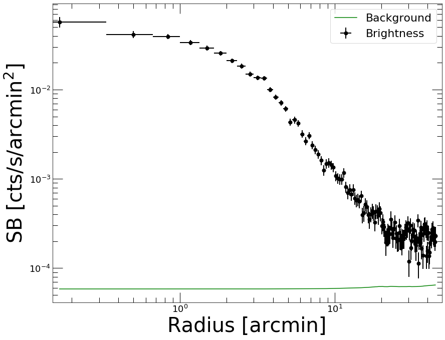

PSF modeling
------------

To correct for PSF smearing, we need to create a PSF mixing matrix which
describes the leaking of photons from each annulus to the others. The
shape of the PSF needs to be known a priori. The definition of the PSF
can be done either by providing an input image or through an analytical
function.

In the following example we model the ROSAT/PSPC PSF as a King function
with a core radius of 25 arcsec

.. code:: python

    def fking(x):
        r0=25./60. # arcmin
        alpha=1.5 # King slope
        return np.power(1. + (x/r0) ** 2, -alpha)

Now we pass this function to the
`PSF <https://pyproffit.readthedocs.io/en/latest/pyproffit.html#pyproffit.profextract.Profile.PSF>`__
method of the
`Profile <https://pyproffit.readthedocs.io/en/latest/pyproffit.html#pyproffit.profextract.Profile>`__
class. To create the mixing matrix, the method creates normalized images
of each annulus individually, convolves them with the PSF using FFT and
computes the fraction of events in the FFT-convolved image that fall
within each annulus. See Eckert et al. (2020) for more details.

.. code:: python

    prof.PSF(psffunc = fking)

Let’s inspect the PSF mixing matrix. Each row describes the fraction
originating from that annulus which are in fact recorded in any other
row

.. code:: python

    fig = plt.figure(figsize=(20,20))
    plt.imshow(np.log10(prof.psfmat), aspect='auto')

.. parsed-literal::

    <matplotlib.image.AxesImage at 0x7fba5c0f6b20>

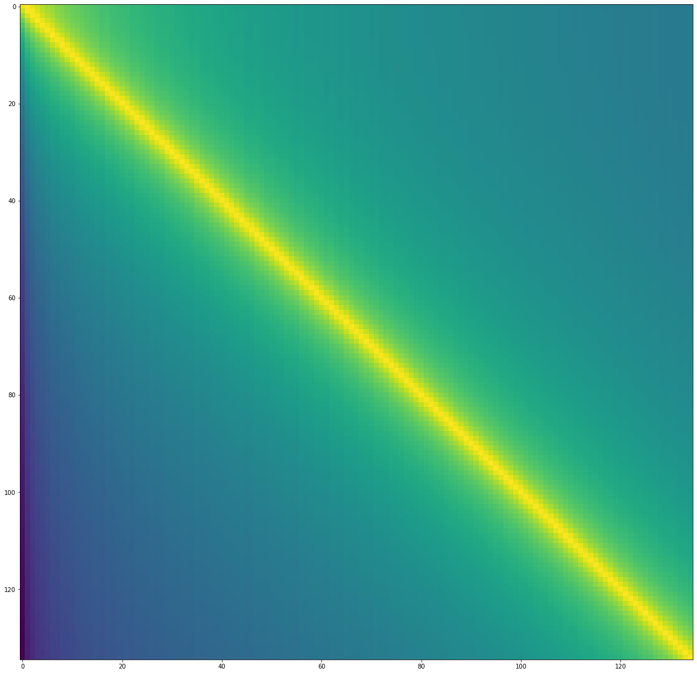

Deprojection
------------

For deprojection, PyProffit implements both the standard onion-peeling
deprojection similar to that of plain Proffit and a new method based on
multiscale decomposition of the observed profile. The new method is
suitable in the low count-rate regime, provides on-the-fly propagation
of the background value and PSF deconvolution.

The two methods can be accessed with the
`Deproject <https://pyproffit.readthedocs.io/en/latest/pyproffit.html#pyproffit.deproject.Deproject>`__
class. For the extraction of density profiles the class requires the
following input:

-  profile=prof: a Profile object containing the data
-  z=redshift: the redshift of the source
-  cf=factor: the conversion between count rate and emission measure

The conversion factor can be computed using the
`calc_emissivity <https://pyproffit.readthedocs.io/en/latest/pyproffit.html#pyproffit.emissivity.calc_emissivity>`__
function, which goes through XSPEC to simulate an absorbed APEC model
with an emission measure of 1 and retrieve the corresponding count rate.
XSPEC needs to be accessible in the PATH for this command to work
properly

.. code:: python

    z_a3158 = 0.059 # Source redshift, here 0.059 for the test cluster A3158
    kt_a3158 = 5.0 # Plasma temperature; if a soft band is used the profile is mildly dependent on it
    nh_a3158 = 0.0118 # Source NH in 1e22 cm**(-2) unit
    rsp = 'pspcb_gain2_256.rsp' # Response file, here ROSAT/PSPC in RSP format
    elow = 0.42 # Lower energy boundary of the image
    ehigh = 2.01 # Upper energy boundary of the image
    
    cf = prof.Emissivity(z=z_a3158,
                        kt=kt_a3158,
                        nh=nh_a3158,
                        rmf=rsp,
                        elow=elow,
                        ehigh=ehigh)
    
    print(cf)

.. parsed-literal::

    45.72

We are now ready to declare the
`Deproject <https://pyproffit.readthedocs.io/en/latest/pyproffit.html#pyproffit.deproject.Deproject>`__
object. Note that in case the redshift and conversion factor are not
known, it is still possible to run the PSF deconvolution and profile
reconstruction, however the gas density profile and gas mass cannot be
computed.

.. code:: python

    depr = pyproffit.Deproject(z=z_a3158, cf=cf, profile=prof)

Let’s start with the multiscale decomposition method. It can be launched
with the
`Multiscale <https://pyproffit.readthedocs.io/en/latest/pyproffit.html#pyproffit.deproject.Deproject.Multiscale>`__
method of the
`Deproject <https://pyproffit.readthedocs.io/en/latest/pyproffit.html#pyproffit.deproject.Deproject>`__
class. The parameters of the method are the following:

-  backend=‘pymc3’: choose whether the optimization will be performed
   with the PyMC3 or the Stan backend
-  nmcmc=1000: number of points in Hamiltonian Monte Carlo chain
-  bkglim=rad: radius beyond which it is assumed that the source is 0
   (i.e. background only)
-  samplefile=file.dat: output file where the HMC samples will be stored

The sampling time with HMC will depend on a number of factors, including
the number of bins in the profile, the number of points in the output
chain, and the bkglim value.

.. code:: python

    depr.Multiscale(nmcmc=1000, bkglim=30.)

.. parsed-literal::

    Running MCMC...

.. parsed-literal::

    logp = -964.14, ||grad|| = 0.31003: 100%|██████████| 296/296 [00:00<00:00, 1598.27it/s] 
    Auto-assigning NUTS sampler...
    Initializing NUTS using jitter+adapt_diag...
    Multiprocess sampling (4 chains in 4 jobs)
    NUTS: [bkg, coefs]
    Sampling 4 chains, 60 divergences: 100%|██████████| 6000/6000 [04:56<00:00, 20.26draws/s]
    There were 14 divergences after tuning. Increase `target_accept` or reparameterize.
    The chain reached the maximum tree depth. Increase max_treedepth, increase target_accept or reparameterize.
    There were 15 divergences after tuning. Increase `target_accept` or reparameterize.
    The chain reached the maximum tree depth. Increase max_treedepth, increase target_accept or reparameterize.
    There were 23 divergences after tuning. Increase `target_accept` or reparameterize.
    The chain reached the maximum tree depth. Increase max_treedepth, increase target_accept or reparameterize.
    There were 8 divergences after tuning. Increase `target_accept` or reparameterize.
    The chain reached the maximum tree depth. Increase max_treedepth, increase target_accept or reparameterize.

.. parsed-literal::

    Done.
     Total computing time is:  5.023633881409963  minutes

The quality of the restruction can be viewed through the
`PlotSB <https://pyproffit.readthedocs.io/en/latest/pyproffit.html#pyproffit.deproject.Deproject.PlotSB>`__
method of the
`Deproject <https://pyproffit.readthedocs.io/en/latest/pyproffit.html#pyproffit.deproject.Deproject>`__
class

.. code:: python

    depr.PlotSB()

.. parsed-literal::

    <Figure size 432x288 with 0 Axes>

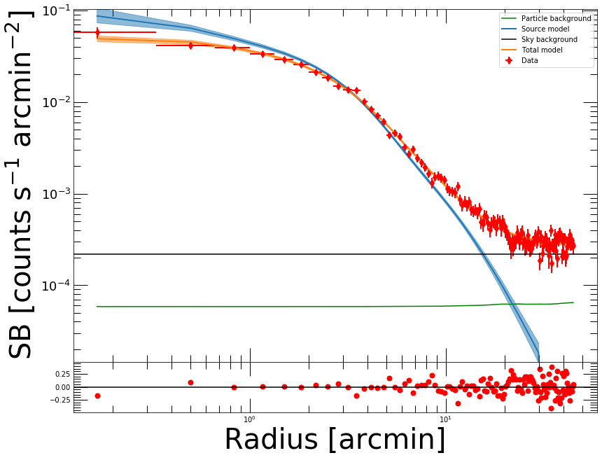

Here the total model (PSF convolved source + background) is shown in
orange. The reconstructed source profile (PSF deconvolved) is shown in
blue, and the fitted sky background is in black. The residuals (bottom
panel) allow the user to assess the quality of the reconstruction.

Count Rates and luminosities
----------------------------

The count rates can be computed easily from the reconstructed surface
brightness profile within any user given apertures. This is done through
the
`CountRate <https://pyproffit.readthedocs.io/en/latest/pyproffit.html#pyproffit.deproject.Deproject.CountRate>`__
method, which integrates the PSF deconvolved model over the area. The
posterior distribution of the count rate can be displayed as well.

.. code:: python

    cr, cr_lo, cr_hi = depr.CountRate(0., 30.)

.. parsed-literal::

    Reconstructed count rate: 2.01205 (1.97796 , 2.0476)

.. parsed-literal::

    <Figure size 432x288 with 0 Axes>

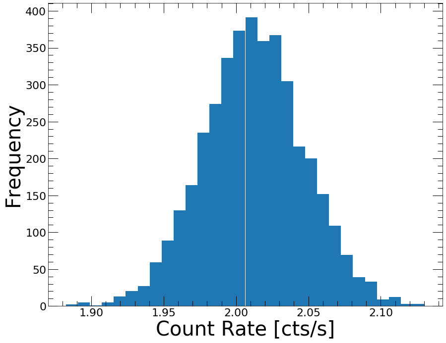

And the luminosity can be obtained similarly through the
`Luminosity <https://pyproffit.readthedocs.io/en/latest/pyproffit.html#pyproffit.deproject.Deproject.Luminosity>`__
method. Similarly to the gas density, the luminosity requires the
emissivity conversion to be calculated

.. code:: python

    lum, lum_lo, lum_hi = depr.Luminosity(0., 30.)

.. parsed-literal::

    Reconstructed luminosity: 1.95819e+44 (1.92501e+44 , 1.99278e+44)

.. parsed-literal::

    <Figure size 432x288 with 0 Axes>

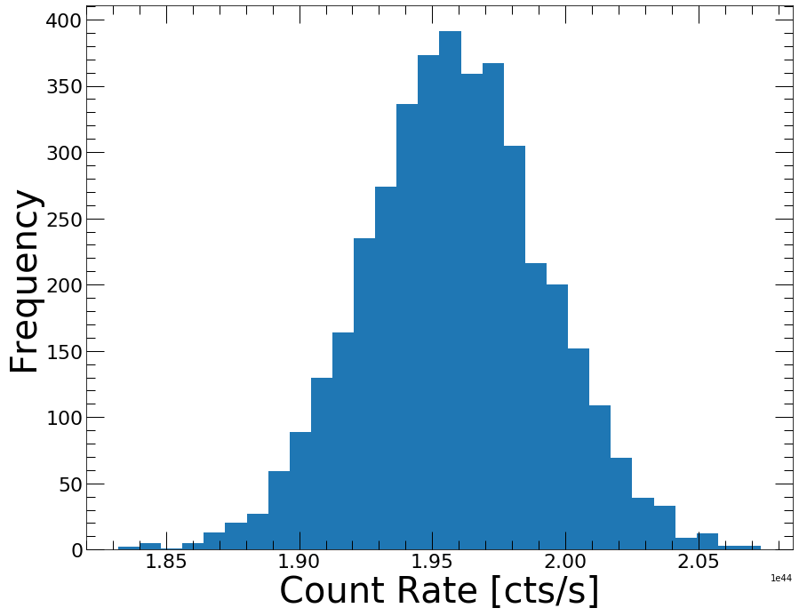

Gas density profile
-------------------

Once a
`Multiscale <https://pyproffit.readthedocs.io/en/latest/pyproffit.html#pyproffit.deproject.Deproject.Multiscale>`__
reconstruction has been performed, and if the source redshift and the
emission measure conversion factor have been provided, it is
straightforward to measure the gas density profile of the source. This
is done through the
`Density <https://pyproffit.readthedocs.io/en/latest/pyproffit.html#pyproffit.deproject.Deproject.Density>`__
method of the
`Deproject <https://pyproffit.readthedocs.io/en/latest/pyproffit.html#pyproffit.deproject.Deproject>`__
class. The gas density profile can then be plotted through the
`PlotDensity <https://pyproffit.readthedocs.io/en/latest/pyproffit.html#pyproffit.deproject.Deproject.PlotDensity>`__
method

.. code:: python

    depr.Density()
    
    depr.PlotDensity()

.. parsed-literal::

    <Figure size 432x288 with 0 Axes>

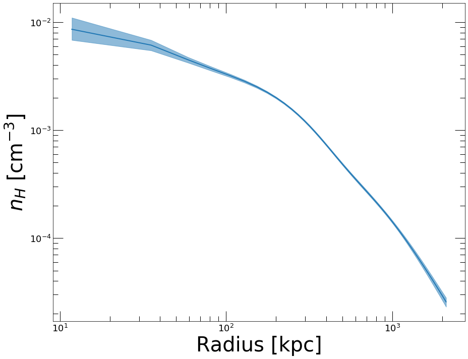

Onion Peeling deprojection
--------------------------

If instead of the multiscale approach one wishes to compute the
deprojected profile using the classical *onion peeling* approach, in
which case the projection kernel is directly inverted, the
`Deproject <https://pyproffit.readthedocs.io/en/latest/pyproffit.html#pyproffit.deproject.Deproject>`__
class contains the
`OnionPeeling <https://pyproffit.readthedocs.io/en/latest/pyproffit.html#pyproffit.deproject.Deproject.OnionPeeling>`__
method.

Note that in this case the background is not reconstructed on-the-fly,
thus this method should be used directly on background subtracted
profiles. Here we provide an example of the use of the
`OnionPeeling <https://pyproffit.readthedocs.io/en/latest/pyproffit.html#pyproffit.deproject.Deproject.OnionPeeling>`__
method. First, let us fit the surface brightness profile beyond 30
arcmin with a constant,

.. code:: python

    mod = pyproffit.Model(pyproffit.Const)
    
    fitconst = pyproffit.Fitter(model=mod, profile=prof)
    
    fitconst.Migrad(fitlow=30., fithigh=40., bkg=-3.5, pedantic=False)

.. parsed-literal::

    ------------------------------------------------------------------
    | FCN = 45.72                   |      Ncalls=22 (22 total)      |
    | EDM = 5.19E-06 (Goal: 0.0002) |            up = 1.0            |
    ------------------------------------------------------------------
    |  Valid Min.   | Valid Param.  | Above EDM | Reached call limit |
    ------------------------------------------------------------------
    |     True      |     True      |   False   |       False        |
    ------------------------------------------------------------------
    | Hesse failed  |   Has cov.    | Accurate  | Pos. def. | Forced |
    ------------------------------------------------------------------
    |     False     |     True      |   True    |   True    | False  |
    ------------------------------------------------------------------
    ------------------------------------------------------------------------------------------
    |   | Name |   Value   | Hesse Err | Minos Err- | Minos Err+ | Limit-  | Limit+  | Fixed |
    ------------------------------------------------------------------------------------------
    | 0 | bkg  |  -3.668   |   0.018   |            |            |         |         |       |
    ------------------------------------------------------------------------------------------

.. code:: python

    prof.Plot(model=mod, axes=[30., 40., 5e-5, 1e-3])

.. parsed-literal::

    <Figure size 432x288 with 0 Axes>

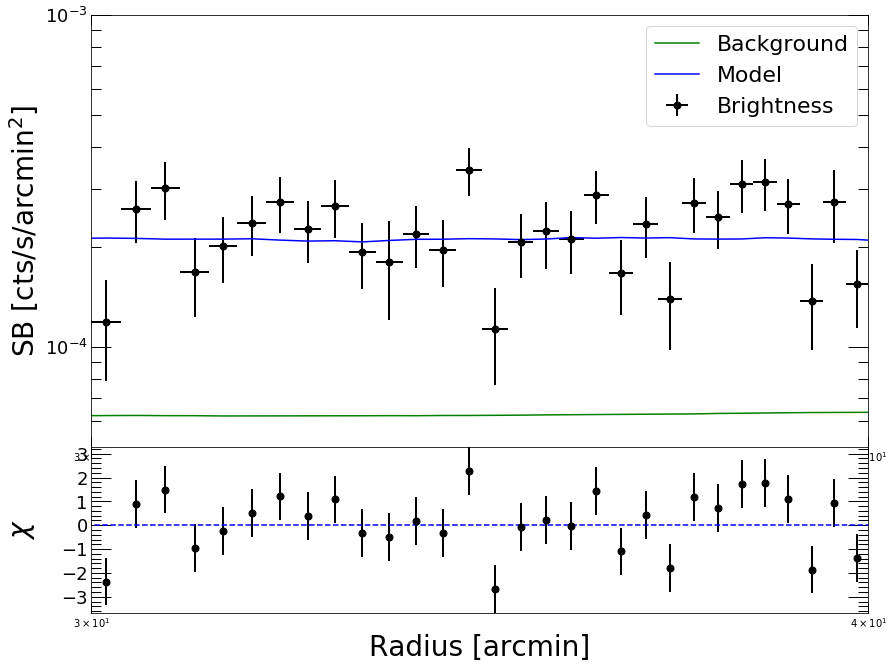

Now we define a new
`Profile <https://pyproffit.readthedocs.io/en/latest/pyproffit.html#pyproffit.profextract.Profile>`__
object with a logarithmic binning, from which we will subtract the
fitted background

.. code:: python

    prof2 = pyproffit.Profile(dat, center_choice='peak', binsize=30, maxrad=30., binning='log')
    
    prof2.SBprofile()
    
    prof2.Backsub(fitconst)

.. parsed-literal::

    Determining X-ray peak
    Coordinates of surface-brightness peak: 272.0 281.0
    Corresponding FK5 coordinates:  55.72147733144434 -53.628226297404545

.. code:: python

    prof2.Plot()

.. parsed-literal::

    <Figure size 432x288 with 0 Axes>

.. image:: Deprojection_files/Deprojection_33_1.png

Now we are ready to define a new
`Deproject <https://pyproffit.readthedocs.io/en/latest/pyproffit.html#pyproffit.deproject.Deproject>`__
object and apply the
`OnionPeeling <https://pyproffit.readthedocs.io/en/latest/pyproffit.html#pyproffit.deproject.Deproject.OnionPeeling>`__
method,

.. code:: python

    depr_op = pyproffit.Deproject(profile=prof2, cf=cf, z=z_a3158)
    
    depr_op.OnionPeeling()

.. code:: python

    depr_op.PlotDensity(xscale='arcmin')

.. parsed-literal::

    <Figure size 432x288 with 0 Axes>

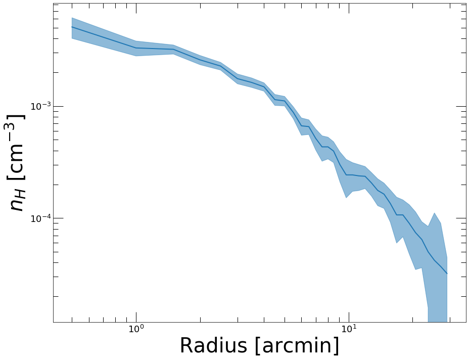

Clearly we want to know how the two methods compare. The
`plot_multi_methods <https://pyproffit.readthedocs.io/en/latest/pyproffit.html#pyproffit.deproject.plot_multi_methods>`__
function allows the user to easily compare the results of several
density profile reconstructions

.. code:: python

    outfig = pyproffit.plot_multi_methods(deps = (depr, depr_op), 
                                profs = (prof, prof2),
                                labels = ('Multiscale', 'Onion Peeling'))

.. parsed-literal::

    Showing 2 density profiles

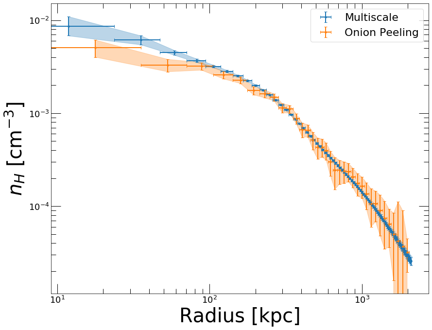

Clearly the two methods are consistent, but the
`Multiscale <https://pyproffit.readthedocs.io/en/latest/pyproffit.html#pyproffit.deproject.Deproject.Multiscale>`__
approach is much less noisy. In the central regions we can easily notice
the effect of the PSF deconvolution in the
`Multiscale <https://pyproffit.readthedocs.io/en/latest/pyproffit.html#pyproffit.deproject.Deproject.Multiscale>`__
case; in the
`OnionPeeling <https://pyproffit.readthedocs.io/en/latest/pyproffit.html#pyproffit.deproject.Deproject.OnionPeeling>`__
case no PSF deconvolution can be applied.

If instead of PyMC3 one wishes to use the (usually more computationally
efficient) Stan backend, it is easy to set it up when calling
`Multiscale <https://pyproffit.readthedocs.io/en/latest/pyproffit.html#pyproffit.deproject.Data.Multiscale>`__
by using the *backend=‘stan’* option. The results of PyMC3 and Stan are
usually indistinguishable.

Gas masses
----------

The gas mass profile is the integral of the gas density profile over the
volume. The
`Deproject <https://pyproffit.readthedocs.io/en/latest/pyproffit.html#pyproffit.deproject.Deproject>`__
class contains two methods to compute the gas mass profile and the
posterior distribution of :math:`M_{gas}` evaluated at a specific
radius.
`PlotMgas <https://pyproffit.readthedocs.io/en/latest/pyproffit.html#pyproffit.deproject.Deproject.PlotMgas>`__
allows the user to view the total reconstructed :math:`M_{gas}` profile,
wherease
`Mgas <https://pyproffit.readthedocs.io/en/latest/pyproffit.html#pyproffit.deproject.Deproject.Mgas>`__
computes :math:`M_{gas}` at any user given radius (in kpc) and plot the
posterior distribution of this value.

.. code:: python

    depr.PlotMgas()

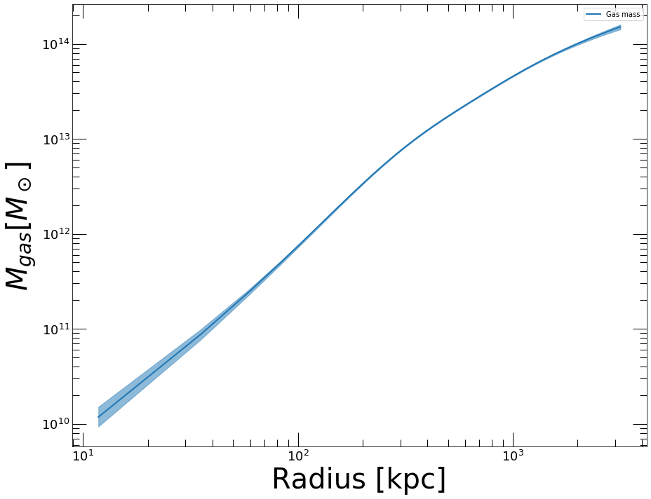

Now let’s say for instance that we want to compute :math:`M_{gas}` at
:math:`R_{500}=1123 \pm 50` kpc. The
`Mgas <https://pyproffit.readthedocs.io/en/latest/pyproffit.html#pyproffit.deproject.Deproject.Mgas>`__
method evaluates the gas mass at the provided overdensity radius. The
uncertainty in the overdensity radius can be propagated to the posterior
:math:`M_{gas}` distribution by randomizing the radius out to which the
profile is integrated

.. code:: python

    mg_r500, mg_lo, mg_hi = depr.Mgas(radius = 1123., radius_err=50.)

.. parsed-literal::

    <Figure size 432x288 with 0 Axes>

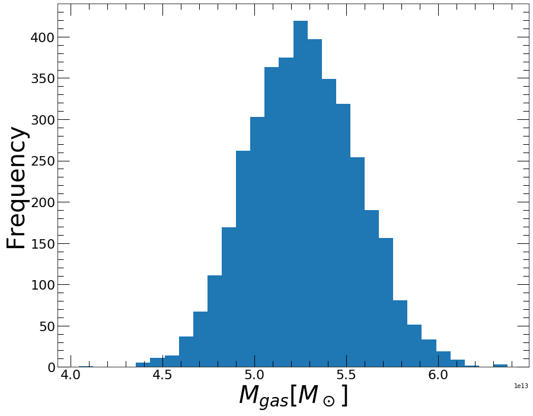

