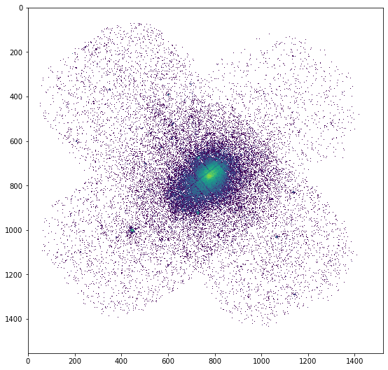
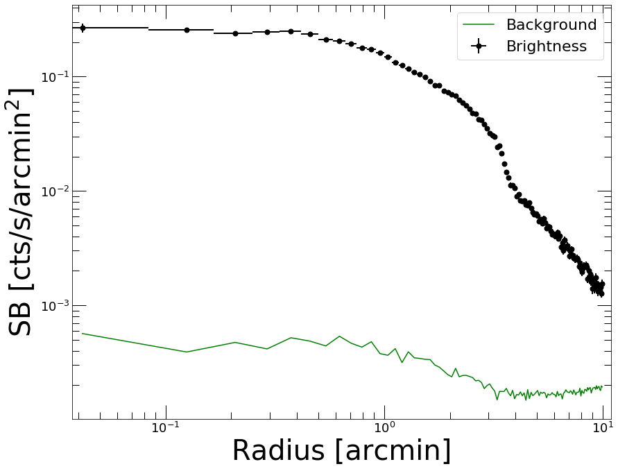
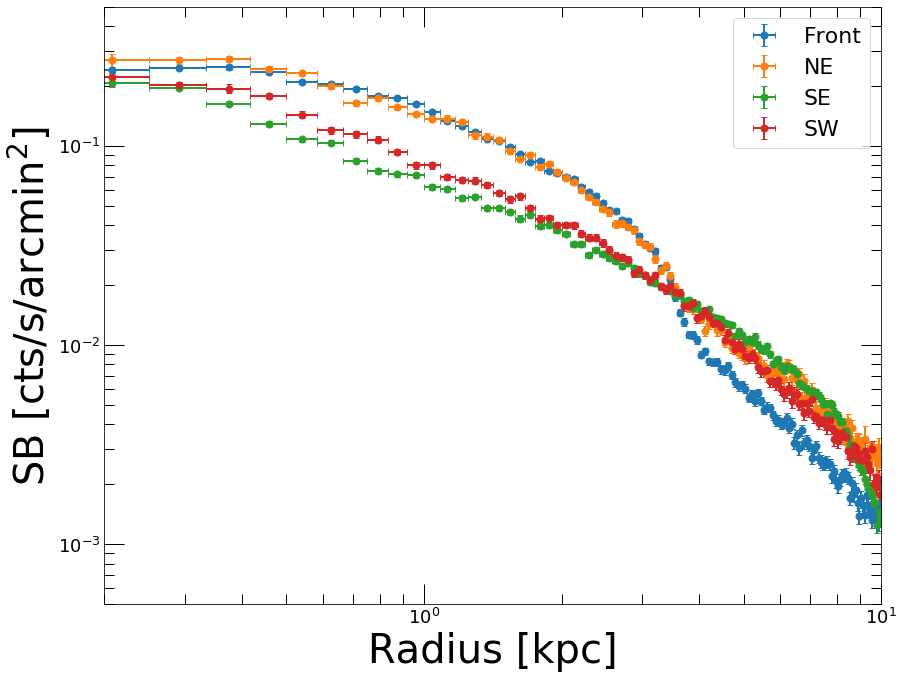
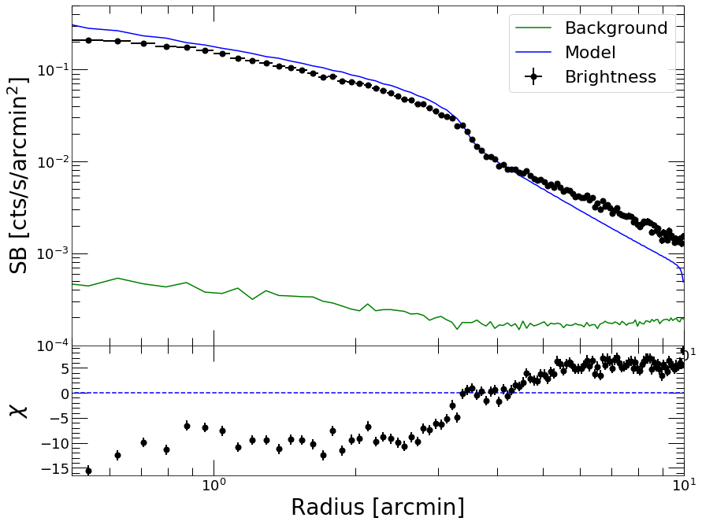
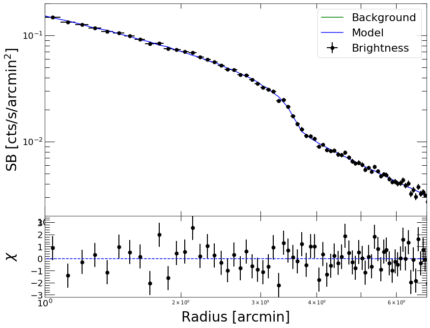
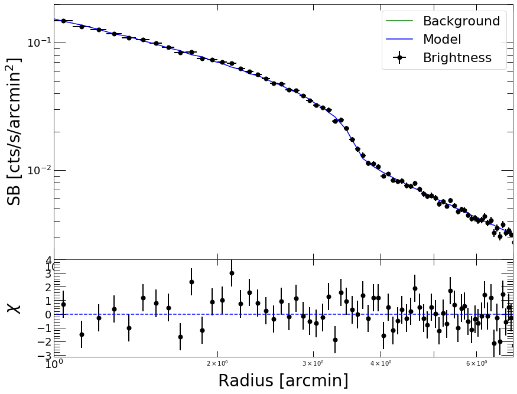

Example: Modeling surface brightness discontinuities
====================================================

This tutorial shows how to use PyProffit to model surface brightness
discontinuities in galaxy clusters (shocks and cold fronts), in
particular to determine the density compression factor. Here we take the
example of *XMM-Newton* observations of A2142 (z=0.09), which hosts one
of the most famous cold fronts and the first to be recognized as such
(Markevitch et al. 2000).

.. code:: python

    import numpy as np
    import pyproffit
    import matplotlib.pyplot as plt

We start by loading the image, exposure map and background map into a
`Data <https://pyproffit.readthedocs.io/en/latest/pyproffit.html#pyproffit.data.Data>`__
structure

.. code:: python

    dat = pyproffit.Data(imglink='/home/deckert/Documents/Work/cluster_data/VLP/a2142/mosaic_a2142.fits.gz',
                        explink='/home/deckert/Documents/Work/cluster_data/VLP/a2142/mosaic_a2142_expo.fits.gz',
                        bkglink='/home/deckert/Documents/Work/cluster_data/VLP/a2142/mosaic_a2142_bkg.fits.gz')

.. parsed-literal::

    WARNING: FITSFixedWarning: RADECSYS= 'FK5 ' / Stellar reference frame 
    the RADECSYS keyword is deprecated, use RADESYSa. [astropy.wcs.wcs]
    WARNING: FITSFixedWarning: EQUINOX = '2000.0 ' / Coordinate system equinox 
    a floating-point value was expected. [astropy.wcs.wcs]

Let’s have a look at the data. Here it is a mosaic of several
*XMM-Newton* pointings:

.. code:: python

    fig = plt.figure(figsize=(20,20))
    s1=plt.subplot(221)
    plt.imshow(np.flipud(np.log10(dat.img)),aspect='auto')

.. parsed-literal::

    <matplotlib.image.AxesImage at 0x7f96a22b6b50>

We mask the detected point sources to avoid contaminating the profile

.. code:: python

    dat.region('/home/deckert/Documents/Work/cluster_data/VLP/a2142/src_ps.reg')

.. parsed-literal::

    Excluded 226 sources

The cold front is located about 3 arcmin North-West of the cluster core,
i.e. in the top-right direction in the above plot. By inspecting the
image with DS9 we need to get an idea of the geometry of the front,
i.e. we need to define a sector across which the front will be sharpest.
In this case the front is highly elliptical, with a position angle that
is rotated by ~40 degrees with respect to the Right Ascension axis.

We now define a
`Profile <https://pyproffit.readthedocs.io/en/latest/pyproffit.html#pyproffit.profextract.Profile>`__
to which we pass the necessary information. We will extract a profile
centered on R.A.= 239.5863, Dec=27.226989 with a linear binning of 5
arcsec width out to 10 arcmin

.. code:: python

    prof = pyproffit.Profile(data=dat, binsize=5., maxrad=10., 
                             center_choice='custom_fk5', center_ra=239.5863, center_dec=27.226989)

.. parsed-literal::

    Corresponding pixels coordinates:  775.303810518434 791.9785944739778

Now we extract the profile using the
`SBprofile <https://pyproffit.readthedocs.io/en/latest/pyproffit.html#pyproffit.profextract.Profile.SBprofile>`__
method of the
`Profile <https://pyproffit.readthedocs.io/en/latest/pyproffit.html#pyproffit.profextract.Profile>`__
class. We select the data in a sector between position angles 10 and 70
degrees, across an ellipse rotated by 40 degrees and with a
major-to-minor axis ratio of 1.65

.. code:: python

    prof.SBprofile(rotation_angle=40., ellipse_ratio=1.65,
                  angle_low=10., angle_high=70.)

.. code:: python

    prof.Plot()

.. parsed-literal::

    <Figure size 432x288 with 0 Axes>

Comparing sectors
-----------------

The break in the profile between 3 and 4 arcmin is well visible. We can
inspect it further by comparing the brightness across several sectors;
this is done by defining other
`Profile <https://pyproffit.readthedocs.io/en/latest/pyproffit.html#pyproffit.profextract.Profile>`__
objects and comparing them using the
`plot_multi_profiles <https://pyproffit.readthedocs.io/en/latest/pyproffit.html#pyproffit.profextract.plot_multi_profiles>`__
function

.. code:: python

    prof_se = pyproffit.Profile(data=dat, binsize=5., maxrad=10., 
                             center_choice='custom_fk5', center_ra=239.5863, center_dec=27.226989)
    
    prof_ne = pyproffit.Profile(data=dat, binsize=5., maxrad=10., 
                             center_choice='custom_fk5', center_ra=239.5863, center_dec=27.226989)
    
    prof_sw = pyproffit.Profile(data=dat, binsize=5., maxrad=10., 
                             center_choice='custom_fk5', center_ra=239.5863, center_dec=27.226989)

.. parsed-literal::

    Corresponding pixels coordinates:  775.303810518434 791.9785944739778
    Corresponding pixels coordinates:  775.303810518434 791.9785944739778
    Corresponding pixels coordinates:  775.303810518434 791.9785944739778

In the new
`Profile <https://pyproffit.readthedocs.io/en/latest/pyproffit.html#pyproffit.profextract.Profile>`__
structures we now load brightness profiles in sectors of 60 degree
opening along 4 perpendicular directions

.. code:: python

    prof_se.SBprofile(rotation_angle=40., ellipse_ratio=1.65,
                  angle_low=190., angle_high=250.)
    
    prof_ne.SBprofile(rotation_angle=40., ellipse_ratio=1.65,
                  angle_low=100., angle_high=160.)
    
    prof_sw.SBprofile(rotation_angle=40., ellipse_ratio=1.65, 
                     angle_low=280., angle_high=340.)

We can now display all 4 profiles together using the
`plot_multi_profiles <https://pyproffit.readthedocs.io/en/latest/pyproffit.html#pyproffit.profextract.plot_multi_profiles>`__
function

.. code:: python

    fig = pyproffit.plot_multi_profiles(profs=(prof, prof_ne, prof_se, prof_sw),
                                 labels=('Front', 'NE', 'SE', 'SW'),
                                 axes=[0.2, 10., 5e-4, 0.5])

.. parsed-literal::

    Showing 4 brightness profiles

We can see clearly the difference between the various sectors. The
sectors on the South show no discontinuity around 3-4 arcmin. The front
can be observed as well in the NE direction, although it is not as sharp
as in the direction that we previously identified (labeled as ‘Front’
here).

Modeling the brightness profile
-------------------------------

Now that we are confident that we have identified the feature of
interest, let’s try to model it. First, we need to account for the
*XMM-Newton* PSF, which smears the gradient across the front and would
lead to an underestimation of the compression factor. To this aim, we
create a function describing the *XMM-Newton* PSF as a function of
distance, and we use the
`PSF <https://pyproffit.readthedocs.io/en/latest/pyproffit.html#pyproffit.profextract.Profile.PSF>`__
method to generate a PSF mixing matrix. We describe the *XMM-Newton* PSF
as a King function with parameters provided in the calibration files

.. code:: python

    # Function describing the PSF
    def fking(x):
        r0=0.0883981 # core radius in arcmin
        alpha=1.58918 # outer slope
        return np.power(1.+(x/r0)**2,-alpha)
    
    prof.PSF(psffunc=fking)

As is usually done in these cases, we assume that the 3D distribution is
described as two power laws with an infinitely narrow discontinuity. The
3D broken power law is then projected onto the line of sight:

.. math::  I(r)=I_0 \int F(\omega)^2\, d\ell + B

with :math:`\omega^2 = r^2 + \ell^2` and

.. math::  F(\omega) = \left\{ \begin{array}{ll} \omega^{-\alpha_1}, & \omega<r_f \\ \frac{1}{C}\omega^{-\alpha_2}, & \omega \geq r_f \end{array} \right. 

PyProffit includes the
`BknPow <https://pyproffit.readthedocs.io/en/latest/pyproffit.html#pyproffit.models.BknPow>`__
function which implements this model. We now define a
`Model <https://pyproffit.readthedocs.io/en/latest/pyproffit.html#pyproffit.models.Model>`__
object containing the appropriate model

.. code:: python

    modbkn = pyproffit.Model(pyproffit.BknPow)
    
    print(modbkn.parnames)

.. parsed-literal::

    ('alpha1', 'alpha2', 'rf', 'norm', 'jump', 'bkg')

To choose appropriate starting points for the parameter, we can set up
initial values by hand and inspect how the model compares to the data

.. code:: python

    modbkn.SetParameters([0.8, 2., 3.5, -1.8, 1.8, -4.])
    
    prof.Plot(model=modbkn, axes=[0.5, 10., 1e-4, 0.5])

.. parsed-literal::

    <Figure size 432x288 with 0 Axes>

We are now ready to optimize the model. To do this, we set up a
`Fitter <https://pyproffit.readthedocs.io/en/latest/pyproffit.html#pyproffit.fitting.Fitter>`__
object and pass to it the data and the model. We run the optimization
using the
`Migrad <https://pyproffit.readthedocs.io/en/latest/pyproffit.html#pyproffit.fitting.Fitter.Migrad>`__
method of the
`Fitter <https://pyproffit.readthedocs.io/en/latest/pyproffit.html#pyproffit.fitting.Fitter>`__
class.

To focus on the region surrounding the front, we fit the data between 1
and 7 arcmin such that we still have a good handle of the slopes in the
upstream and downstream regions, whilst being insensitive to the
behavior of the profile far away from the front. The fitting range is
specified using the *fitlow* and *fithigh* parameters of the
`Migrad <https://pyproffit.readthedocs.io/en/latest/pyproffit.html#pyproffit.fitting.Fitter.Migrad>`__
method

.. code:: python

    fitobj = pyproffit.Fitter(model=modbkn, profile=prof)
    
    fitobj.Migrad(pedantic=False, alpha1=0.8, alpha2=2.0, rf=3.5, jump=1.8, norm=-1.8, bkg=-4.0, 
                  fitlow=1.0, fithigh=7.0)

.. parsed-literal::

    ------------------------------------------------------------------
    | FCN = 75.02                   |     Ncalls=845 (845 total)     |
    | EDM = 7.45E-05 (Goal: 0.0002) |            up = 1.0            |
    ------------------------------------------------------------------
    |  Valid Min.   | Valid Param.  | Above EDM | Reached call limit |
    ------------------------------------------------------------------
    |     True      |     True      |   False   |       False        |
    ------------------------------------------------------------------
    | Hesse failed  |   Has cov.    | Accurate  | Pos. def. | Forced |
    ------------------------------------------------------------------
    |     False     |     True      |   True    |   True    | False  |
    ------------------------------------------------------------------
    --------------------------------------------------------------------------------------------
    |   | Name   |   Value   | Hesse Err | Minos Err- | Minos Err+ | Limit-  | Limit+  | Fixed |
    --------------------------------------------------------------------------------------------
    | 0 | alpha1 |   0.865   |   0.013   |            |            |         |         |       |
    | 1 | alpha2 |   1.52    |   0.18    |            |            |         |         |       |
    | 2 | rf     |   3.609   |   0.026   |            |            |         |         |       |
    | 3 | norm   |  -1.945   |   0.011   |            |            |         |         |       |
    | 4 | jump   |   1.92    |   0.07    |            |            |         |         |       |
    | 5 | bkg    |   -3.8    |    2.3    |            |            |         |         |       |
    --------------------------------------------------------------------------------------------

The *Valid Min.=True* output indicates that the minimization was
performed successfully. The best-fit parameters are now officially
loaded into the
`Model <https://pyproffit.readthedocs.io/en/latest/pyproffit.html#pyproffit.models.Model>`__
object. The retrieved compression factor (the *jump* parameter) of
:math:`1.92\pm0.07` agrees well with the value measured by *Chandra* for
this front, :math:`2.0\pm0.1` (Owers et al. 2009).

Now let us check the quality of the fit

.. code:: python

    prof.Plot(model=modbkn, axes=[1., 7., 2e-3, 0.2])

.. parsed-literal::

    <Figure size 432x288 with 0 Axes>

That looks very good. Now if instead of using :math:`\chi^2` as our
likelihood function, we wish to use `C
statistic <https://pyproffit.readthedocs.io/en/latest/pyproffit.html#pyproffit.fitting.Cstat>`__,
we can run the minimization again using the *method=‘cstat’* option. We
can also fix the *bkg* parameter since it is not very relevant in this
region and its value is not well constrained

.. code:: python

    fitobj.Migrad(method='cstat', pedantic=False, alpha1=0.9, alpha2=1.5, rf=3.609, jump=1.92, norm=-1.9, bkg=-3.8, 
                  fitlow=1.0, fithigh=7.0, fix_bkg=True)

.. parsed-literal::

    ------------------------------------------------------------------
    | FCN = 76.78                   |     Ncalls=199 (199 total)     |
    | EDM = 2.04E-05 (Goal: 0.0002) |            up = 1.0            |
    ------------------------------------------------------------------
    |  Valid Min.   | Valid Param.  | Above EDM | Reached call limit |
    ------------------------------------------------------------------
    |     True      |     True      |   False   |       False        |
    ------------------------------------------------------------------
    | Hesse failed  |   Has cov.    | Accurate  | Pos. def. | Forced |
    ------------------------------------------------------------------
    |     False     |     True      |   True    |   True    | False  |
    ------------------------------------------------------------------
    --------------------------------------------------------------------------------------------
    |   | Name   |   Value   | Hesse Err | Minos Err- | Minos Err+ | Limit-  | Limit+  | Fixed |
    --------------------------------------------------------------------------------------------
    | 0 | alpha1 |   0.880   |   0.012   |            |            |         |         |       |
    | 1 | alpha2 |   1.494   |   0.025   |            |            |         |         |       |
    | 2 | rf     |   3.615   |   0.023   |            |            |         |         |       |
    | 3 | norm   |  -1.957   |   0.011   |            |            |         |         |       |
    | 4 | jump   |   1.92    |   0.04    |            |            |         |         |       |
    | 5 | bkg    |   -3.8    |    1.0    |            |            |         |         |  yes  |
    --------------------------------------------------------------------------------------------

.. code:: python

    prof.Plot(model=modbkn, axes=[1., 7., 2e-3, 0.2])

.. parsed-literal::

    <Figure size 432x288 with 0 Axes>

The results obtained with the two likelihood functions are nicely
consistent. In case of low quality data, however, the results obtained
with C-statistic should be preferred.

Results and uncertainties
-------------------------

The results of the fitting procedure are stored in the *params* and
*errors* attributes of the
`Fitter <https://pyproffit.readthedocs.io/en/latest/pyproffit.html#pyproffit.fitting.Fitter>`__
object

.. code:: python

    print(fitobj.params)
    print(fitobj.errors)

.. parsed-literal::

    <ValueView of Minuit at 7cdd690>
      alpha1: 0.8798487662991042
      alpha2: 1.4944879185348559
      rf: 3.6146609030525685
      norm: -1.9569405180063548
      jump: 1.9197397493836217
      bkg: -3.8
    <ErrorView of Minuit at 7cdd690>
      alpha1: 0.01233477743691411
      alpha2: 0.025231142272098477
      rf: 0.023289800564219486
      norm: 0.011053512887877351
      jump: 0.03619430348226856
      bkg: 1.0

The *Migrad* function of `iminuit <https://iminuit.readthedocs.io>`__ is
a very efficient optimization algorithm, however it is not designed to
determine accurate, asymmetric error bars. For this purpose, iminuit
includes the *Minos* algorithm, which can be ran easily from PyProffit

.. code:: python

    minos_result = fitobj.minuit.minos()

The uncertainties in the *jump* parameter can be viewed and accessed in
the following way

.. code:: python

    minos_result['jump']

.. raw:: html

    <table>
    <tr>
    <th title="Parameter name">
    jump
    </th>
    <td align="center" colspan="2" style="background-color:#92CCA6;">
    Valid
    </td>
    </tr>
    <tr>
    <td title="Lower and upper minos error of the parameter">
    Error
    </td>
    <td>
    -0.04
    </td>
    <td>
     0.04
    </td>
    </tr>
    <tr>
    <td title="Validity of lower/upper minos error">
    Valid
    </td>
    <td style="background-color:#92CCA6;">
    True
    </td>
    <td style="background-color:#92CCA6;">
    True
    </td>
    </tr>
    <tr>
    <td title="Did scan hit limit of any parameter?">
    At Limit
    </td>
    <td style="background-color:#92CCA6;">
    False
    </td>
    <td style="background-color:#92CCA6;">
    False
    </td>
    </tr>
    <tr>
    <td title="Did scan hit function call limit?">
    Max FCN
    </td>
    <td style="background-color:#92CCA6;">
    False
    </td>
    <td style="background-color:#92CCA6;">
    False
    </td>
    </tr>
    <tr>
    <td title="New minimum found when doing scan?">
    New Min
    </td>
    <td style="background-color:#92CCA6;">
    False
    </td>
    <td style="background-color:#92CCA6;">
    False
    </td>
    </tr>
    </table>

.. code:: python

    print('Best fitting compression factor : %g (%g , %g)' 
          % (fitobj.params['jump'], minos_result['jump'].lower, minos_result['jump'].upper))

.. parsed-literal::

    Best fitting compression factor : 1.91974 (-0.0357733 , 0.036702)

Correlations between parameters can be investigated using the
draw_mncontour method. Here we show the usual correlation between the
outer slope of the profile :math:`\alpha_2` and the compression factor

.. code:: python

    fitobj.minuit.draw_mncontour('alpha2', 'jump')

.. parsed-literal::

    <matplotlib.contour.ContourSet at 0x7f969bd101c0>

.. image:: Discontinuities_files/Discontinuities_42_1.png

