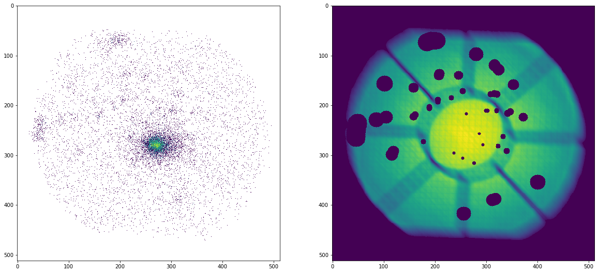
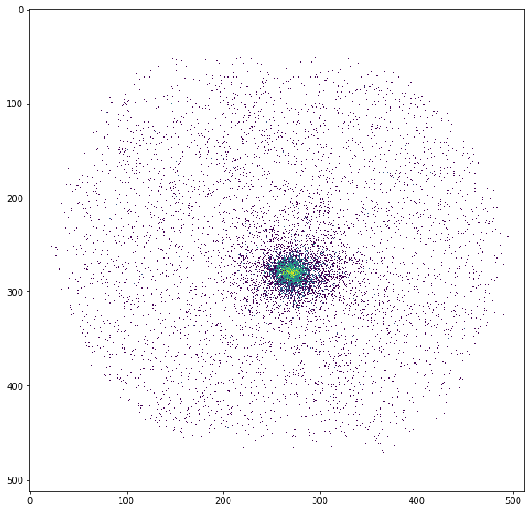
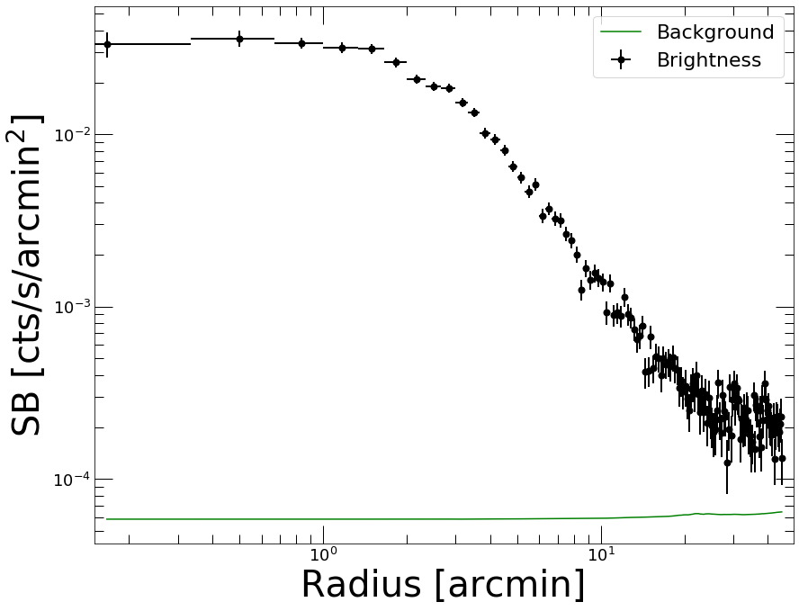
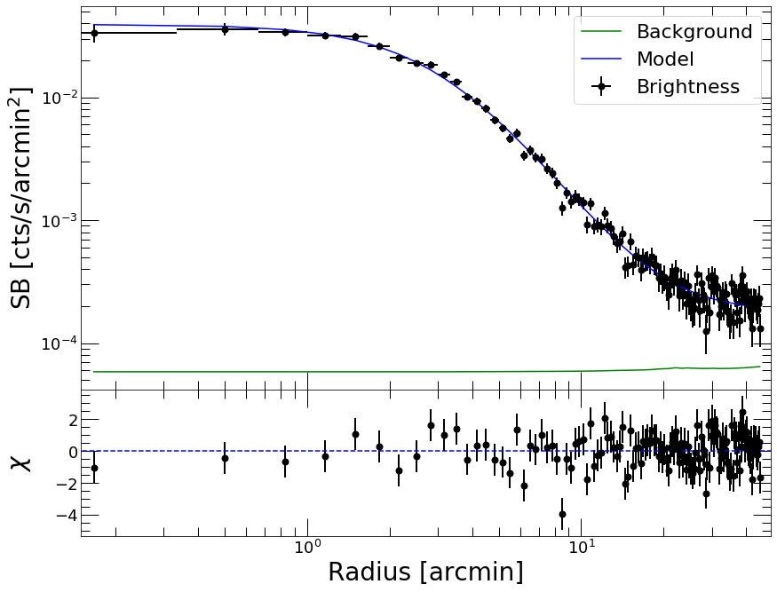
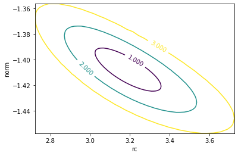
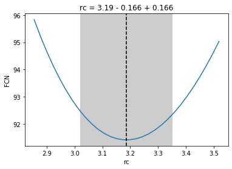
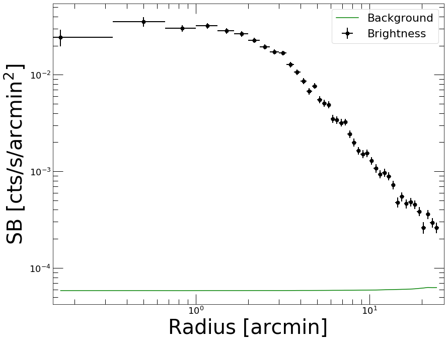
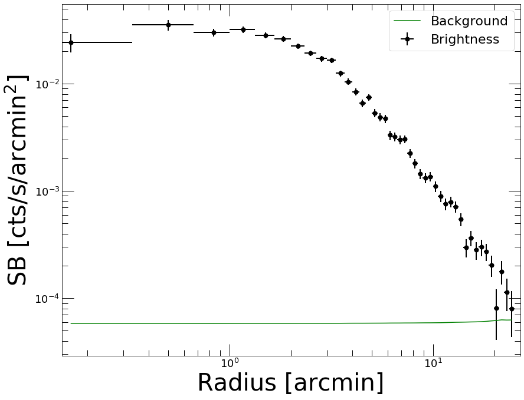
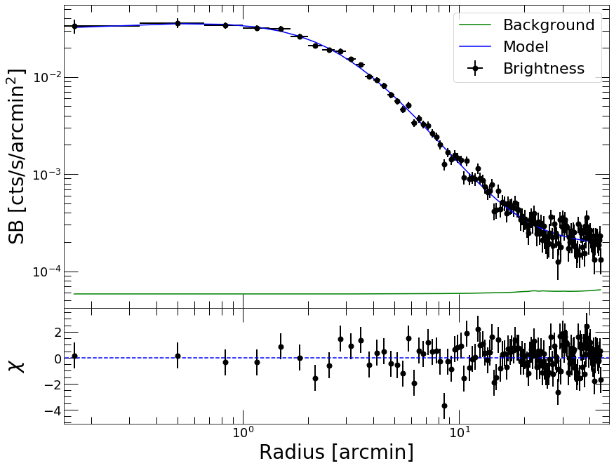

Example: Surface brightness profile extraction and fitting
==========================================================

This thread shows how to read data, extract surface brightness profiles,
fit data and extract density profiles with *PyProffit*.

We start by loading the packages:

.. code:: python

    import numpy as np
    import pyproffit
    import matplotlib.pyplot as plt

Then we can move to the data directory with the *os* package.

.. code:: python

    import os
    
    # Change this to the proper directory containing your run
    os.chdir('../../validation/')
    os.listdir()

.. parsed-literal::

    ['test_sb.fits',
     'gsb.fits',
     'expose_mask_37.fits.gz',
     'test_density.pdf',
     'commands.xcm',
     'test_outmod.fits',
     'test_script.py',
     '.ipynb_checkpoints',
     'test_plot_fit.pdf',
     'test_rec_stan.pdf',
     'reference_depr.fits',
     'test_save_all.fits',
     'pspcb_gain2_256.rsp',
     'b_37.fits.gz',
     'reference_psf.dat',
     'test_dmfilth.fits',
     'Untitled1.ipynb',
     'back_37.fits.gz',
     'reference_pymc3.dat',
     'comp_rec.pdf',
     'test_region.reg',
     'test_mgas.pdf',
     'mybeta_GP.stan',
     'reference_OP.dat',
     'pspcb_gain2_256.fak',
     'Untitled.ipynb',
     'sim.txt']

Now we load the data inside a
`Data <https://pyproffit.readthedocs.io/en/latest/pyproffit.html#pyproffit.data.Data>`__
object in PyProffit structure:

.. code:: python

    dat=pyproffit.Data(imglink='b_37.fits.gz',explink='expose_mask_37.fits.gz',
                       bkglink='back_37.fits.gz')

.. parsed-literal::

    WARNING: FITSFixedWarning: RADECSYS= 'FK5 ' / Equatorial system reference 
    the RADECSYS keyword is deprecated, use RADESYSa. [astropy.wcs.wcs]

1. Here imglink=\ *‘epic-obj-im-700-1200.fits’* is the link to the image
   file (count map) to be loaded.
2. The option *explink=*\ ’epic-exp-im-700-1200.fits’ allows the user to
   load an exposure map for vignetting correction. In case this option
   is left blank, a uniform exposure of 1s is assumed for the
   observation.
3. The option *bkglink=*\ ’epic-back-oot-sky-700-1200.fits’ allows to
   load an external background map, which will be used when extracting
   surface brightness profiles.

The images are then loaded into the
`Data <https://pyproffit.readthedocs.io/en/latest/pyproffit.html#pyproffit.data.Data>`__
structure and can be easily accessed as below:

.. code:: python

    fig = plt.figure(figsize=(20,20))
    s1=plt.subplot(221)
    plt.imshow(np.log10(dat.img),aspect='auto')
    s2=plt.subplot(222)
    plt.imshow(dat.exposure,aspect='auto')

.. parsed-literal::

    <matplotlib.image.AxesImage at 0x7fe900b37dc0>

All the areas with zero exposure will be automatically excluded. We can
ignore additional regions using the
`region <https://pyproffit.readthedocs.io/en/latest/pyproffit.html#pyproffit.data.Data.region>`__
method of the
`Data <https://pyproffit.readthedocs.io/en/latest/pyproffit.html#pyproffit.data.Data>`__
class, which loads a DS9 region file (in image or FK5 format):

.. code:: python

    dat.region('../tests/dmfilth.reg')

.. parsed-literal::

    Excluded 2 sources

The exposure in the requested areas has been set to 0. Let’s look at the
output:

.. code:: python

    plt.clf()
    fig = plt.figure(figsize=(10,10))
    plt.imshow(dat.exposure,aspect='auto')

.. parsed-literal::

    <matplotlib.image.AxesImage at 0x7fe9003b9790>

.. parsed-literal::

    <Figure size 432x288 with 0 Axes>

.. image:: Fitting_files/Fitting_11_2.png

The
`Data <https://pyproffit.readthedocs.io/en/latest/pyproffit.html#pyproffit.data.Data>`__
structure also contains the
`dmfilth <https://pyproffit.readthedocs.io/en/latest/pyproffit.html#pyproffit.data.Data.dmfilth>`__
method, which can be used to fill the masked areas. The method computes
a 2D spline interpolation in between the gaps and generates a Poisson
realization of the spline interpolated data, such that the filled holes
have similar statistical properties to their surroundings

.. code:: python

    dat.dmfilth()

.. parsed-literal::

    Applying high-pass filter
    Interpolating in the masked regions
    Filling holes

.. code:: python

    plt.clf()
    fig = plt.figure(figsize=(10,10))
    plt.imshow(np.log10(dat.filth),aspect='auto')

.. parsed-literal::

    <matplotlib.image.AxesImage at 0x7fe90039a880>

.. parsed-literal::

    <Figure size 432x288 with 0 Axes>

The image produced by
`dmfilth <https://pyproffit.readthedocs.io/en/latest/pyproffit.html#pyproffit.data.Data.dmfilth>`__
is to be compared with the raw image shown above; it is apparent that
the sources have been removed and their area has been replaced by a
Poisson realization of their interpolated surroundings.

In case a
`dmfilth <https://pyproffit.readthedocs.io/en/latest/pyproffit.html#pyproffit.data.Data.dmfilth>`__
image has been generated, the computation of the image centroid and/or
of the surface brightness peak to compute the center of the surface
brightness profile is done on the
`dmfilth <https://pyproffit.readthedocs.io/en/latest/pyproffit.html#pyproffit.data.Data.dmfilth>`__
image rather than on the original image.

Profile extraction
------------------

Now we define a
`Profile <https://pyproffit.readthedocs.io/en/latest/pyproffit.html#pyproffit.profextract.Profile>`__
object in the following way:

.. code:: python

    prof=pyproffit.Profile(dat,center_choice='centroid',maxrad=45.,binsize=20.,centroid_region=30.)

.. parsed-literal::

    Computing centroid and ellipse parameters using principal component analysis
    No approximate center provided, will search for the centroid within a radius of 30 arcmin from the center of the image
    Denoising image...
    Running PCA...
    Centroid position: 272.9693463561232 277.500826446281
    Corresponding FK5 coordinates:  55.71465074133672 -53.64274857192019
    Ellipse axis ratio and position angle: 1.099893588770645 -149.86120200483717

.. raw:: html

   <h3>

Profile class options

.. raw:: html

   </h3>

The class
`Profile <https://pyproffit.readthedocs.io/en/latest/pyproffit.html#pyproffit.profextract.Profile>`__
is designed to contain all the Proffit profile extraction features (not
all of them have been implemented yet). The “center_choice” argument
specifies the choice of the center:

-  center_choice=‘centroid’: compute image centroid and ellipticity
-  center_choice=‘peak’: use brightness peak
-  center_choice=‘custom_fk5’: use custom center in FK5 coordinates
   (degrees), provided by the “center_ra” and “center_dec” arguments
-  center_choice=‘custom_ima’: like custom_fk but with input coordinates
   in image pixels

The other arguments are the following:

-  maxrad: define the maximum radius of the profile (in arcmin)
-  binsize: the width of the bins (in arcsec)
-  center_ra, center_dec: position of the center (if
   center_choice=‘custom_fk5’ or ‘custom_ima’)
-  binsize: minimum bin size in arcsec
-  binning=: specify binnig scheme: ‘linear’ (default), ‘log’, or
   ‘custom’. In the ‘custom’ case, an array with the binning definition
   should be provided through the option bins=array
-  centroid_region: for centroid calculation (center_choice=‘centroid’),
   optionally provide a radius within which the centroid will be
   computed, instead of the entire image.

.. raw:: html

   <h3>

Now let’s extract the profile…

.. raw:: html

   </h3>

.. code:: python

    prof.SBprofile(ellipse_ratio=prof.ellratio,rotation_angle=prof.ellangle+180.)

.. raw:: html

   

Here we have extracted a profile in elliptical annuli centered on the
image centroid (see above), with an ellipse axis ratio (major/minor) and
position angle calculated with principal component analysis. If
ellipse_ratio and ellipse_angle are left blank circular annuli are used.

.. raw:: html

   

-  ellipse_ratio: the ratio of major to minor axis (a/b) of the ellipse
   (default=1, i.e. circular annuli)
-  rotation_angle: rotation angle of the ellipse from the R.A. axis
   (default=0)
-  angle_low, angle_high: in case of profile extraction in sectors, the
   position angle of the minimum and maximum angles of the sector, with
   0 equivalent to the R.A. axis (default=None, i.e. the entire azimuth)

.. raw:: html

   

Now let’s plot the profile…

.. raw:: html

   

.. code:: python

    prof.Plot()

.. parsed-literal::

    <Figure size 432x288 with 0 Axes>

Defining a model
----------------

Models can be defined using the
`Model <https://pyproffit.readthedocs.io/en/latest/pyproffit.html#pyproffit.models.Model>`__
class. PyProffit includes several popular built-in models, however the
`Model <https://pyproffit.readthedocs.io/en/latest/pyproffit.html#pyproffit.models.Model>`__
structure is designed to be compatible with any custom Python function
(see below)

.. code:: python

    mod=pyproffit.Model(pyproffit.BetaModel)

To check the parameters of the
`BetaModel <https://pyproffit.readthedocs.io/en/latest/pyproffit.html#pyproffit.models.BetaModel>`__
function,

.. code:: python

    mod.parnames

.. parsed-literal::

    ('beta', 'rc', 'norm', 'bkg')

Any user-defined Python function operating on NumPy arrays can be
defined here, see below.

Fitting the data
----------------

To fit the extracted profiles PyProffit provides the
`Fitter <https://pyproffit.readthedocs.io/en/latest/pyproffit.html#pyproffit.fitting.Fitter>`__
class, which takes a
`Profile <https://pyproffit.readthedocs.io/en/latest/pyproffit.html#pyproffit.profextract.Profile>`__
and a
`Model <https://pyproffit.readthedocs.io/en/latest/pyproffit.html#pyproffit.models.Model>`__
object as input:

.. code:: python

    fitobj=pyproffit.Fitter(model=mod, profile=prof)
    
    fitobj.Migrad(beta=0.7,rc=2.,norm=-2,bkg=-4,pedantic=False, fix_beta=True, limit_rc=(0, 10))

.. parsed-literal::

    ------------------------------------------------------------------
    | FCN = 148.5                   |     Ncalls=136 (136 total)     |
    | EDM = 1.13E-07 (Goal: 0.0002) |            up = 1.0            |
    ------------------------------------------------------------------
    |  Valid Min.   | Valid Param.  | Above EDM | Reached call limit |
    ------------------------------------------------------------------
    |     True      |     True      |   False   |       False        |
    ------------------------------------------------------------------
    | Hesse failed  |   Has cov.    | Accurate  | Pos. def. | Forced |
    ------------------------------------------------------------------
    |     False     |     True      |   True    |   True    | False  |
    ------------------------------------------------------------------
    ------------------------------------------------------------------------------------------
    |   | Name |   Value   | Hesse Err | Minos Err- | Minos Err+ | Limit-  | Limit+  | Fixed |
    ------------------------------------------------------------------------------------------
    | 0 | beta |    0.7    |    1.0    |            |            |         |         |  yes  |
    | 1 | rc   |   3.48    |   0.06    |            |            |    0    |   10    |       |
    | 2 | norm |  -1.425   |   0.014   |            |            |         |         |       |
    | 3 | bkg  |  -3.712   |   0.014   |            |            |         |         |       |
    ------------------------------------------------------------------------------------------

Here *beta* was fixed to its input value through fix_beta=True option,
and rc was constrained to be in the region [0,10] through the
limit_rc=(0,10) argument.

Now we can plot the data together with the best fitting model

.. code:: python

    prof.Plot(model=mod)

.. parsed-literal::

    <Figure size 432x288 with 0 Axes>

.. raw:: html

   

That’s nice; now if instead of :math:`\chi^2` we want to fit the counts
with C-stat

.. raw:: html

   

.. code:: python

    fitobj.Migrad(method='cstat',beta=0.7,rc=2.,norm=-2.,bkg=-4.,pedantic=False,fitlow=0.,fithigh=30.)

.. parsed-literal::

    ------------------------------------------------------------------
    | FCN = 91.41                   |     Ncalls=237 (237 total)     |
    | EDM = 1.06E-05 (Goal: 0.0002) |            up = 1.0            |
    ------------------------------------------------------------------
    |  Valid Min.   | Valid Param.  | Above EDM | Reached call limit |
    ------------------------------------------------------------------
    |     True      |     True      |   False   |       False        |
    ------------------------------------------------------------------
    | Hesse failed  |   Has cov.    | Accurate  | Pos. def. | Forced |
    ------------------------------------------------------------------
    |     False     |     True      |   True    |   True    | False  |
    ------------------------------------------------------------------
    ------------------------------------------------------------------------------------------
    |   | Name |   Value   | Hesse Err | Minos Err- | Minos Err+ | Limit-  | Limit+  | Fixed |
    ------------------------------------------------------------------------------------------
    | 0 | beta |   0.662   |   0.019   |            |            |         |         |       |
    | 1 | rc   |   3.19    |   0.17    |            |            |         |         |       |
    | 2 | norm |  -1.408   |   0.017   |            |            |         |         |       |
    | 3 | bkg  |   -3.74   |    0.04   |            |            |         |         |       |
    ------------------------------------------------------------------------------------------

Here we have restricted the fitting range to be between 0 and 30 arcmin
through the *fitlow* and *fithigh* arguments. This time, *beta* was left
free while fitting.

.. code:: python

    prof.Plot(model=mod)

.. parsed-literal::

    <Figure size 432x288 with 0 Axes>

Inspecting the results
----------------------

After running *Migrad* the
`Fitter <https://pyproffit.readthedocs.io/en/latest/pyproffit.html#pyproffit.fitting.Fitter>`__
object contains a *minuit* object which can be used to run all *iminuit*
commands. For instance, we can run *minos* to get more accurate errors
on the parameters:

.. code:: python

    fitobj.minuit.minos()

.. raw:: html

    <table>
    <tr>
    <th title="Parameter name">
    beta
    </th>
    <td align="center" colspan="2" style="background-color:#92CCA6;">
    Valid
    </td>
    </tr>
    <tr>
    <td title="Lower and upper minos error of the parameter">
    Error
    </td>
    <td>
    -0.019
    </td>
    <td>
     0.020
    </td>
    </tr>
    <tr>
    <td title="Validity of lower/upper minos error">
    Valid
    </td>
    <td style="background-color:#92CCA6;">
    True
    </td>
    <td style="background-color:#92CCA6;">
    True
    </td>
    </tr>
    <tr>
    <td title="Did scan hit limit of any parameter?">
    At Limit
    </td>
    <td style="background-color:#92CCA6;">
    False
    </td>
    <td style="background-color:#92CCA6;">
    False
    </td>
    </tr>
    <tr>
    <td title="Did scan hit function call limit?">
    Max FCN
    </td>
    <td style="background-color:#92CCA6;">
    False
    </td>
    <td style="background-color:#92CCA6;">
    False
    </td>
    </tr>
    <tr>
    <td title="New minimum found when doing scan?">
    New Min
    </td>
    <td style="background-color:#92CCA6;">
    False
    </td>
    <td style="background-color:#92CCA6;">
    False
    </td>
    </tr>
    </table>
    
    <table>
    <tr>
    <th title="Parameter name">
    rc
    </th>
    <td align="center" colspan="2" style="background-color:#92CCA6;">
    Valid
    </td>
    </tr>
    <tr>
    <td title="Lower and upper minos error of the parameter">
    Error
    </td>
    <td>
    -0.16
    </td>
    <td>
     0.17
    </td>
    </tr>
    <tr>
    <td title="Validity of lower/upper minos error">
    Valid
    </td>
    <td style="background-color:#92CCA6;">
    True
    </td>
    <td style="background-color:#92CCA6;">
    True
    </td>
    </tr>
    <tr>
    <td title="Did scan hit limit of any parameter?">
    At Limit
    </td>
    <td style="background-color:#92CCA6;">
    False
    </td>
    <td style="background-color:#92CCA6;">
    False
    </td>
    </tr>
    <tr>
    <td title="Did scan hit function call limit?">
    Max FCN
    </td>
    <td style="background-color:#92CCA6;">
    False
    </td>
    <td style="background-color:#92CCA6;">
    False
    </td>
    </tr>
    <tr>
    <td title="New minimum found when doing scan?">
    New Min
    </td>
    <td style="background-color:#92CCA6;">
    False
    </td>
    <td style="background-color:#92CCA6;">
    False
    </td>
    </tr>
    </table>
    
    <table>
    <tr>
    <th title="Parameter name">
    norm
    </th>
    <td align="center" colspan="2" style="background-color:#92CCA6;">
    Valid
    </td>
    </tr>
    <tr>
    <td title="Lower and upper minos error of the parameter">
    Error
    </td>
    <td>
    -0.017
    </td>
    <td>
     0.017
    </td>
    </tr>
    <tr>
    <td title="Validity of lower/upper minos error">
    Valid
    </td>
    <td style="background-color:#92CCA6;">
    True
    </td>
    <td style="background-color:#92CCA6;">
    True
    </td>
    </tr>
    <tr>
    <td title="Did scan hit limit of any parameter?">
    At Limit
    </td>
    <td style="background-color:#92CCA6;">
    False
    </td>
    <td style="background-color:#92CCA6;">
    False
    </td>
    </tr>
    <tr>
    <td title="Did scan hit function call limit?">
    Max FCN
    </td>
    <td style="background-color:#92CCA6;">
    False
    </td>
    <td style="background-color:#92CCA6;">
    False
    </td>
    </tr>
    <tr>
    <td title="New minimum found when doing scan?">
    New Min
    </td>
    <td style="background-color:#92CCA6;">
    False
    </td>
    <td style="background-color:#92CCA6;">
    False
    </td>
    </tr>
    </table>
    
    <table>
    <tr>
    <th title="Parameter name">
    bkg
    </th>
    <td align="center" colspan="2" style="background-color:#92CCA6;">
    Valid
    </td>
    </tr>
    <tr>
    <td title="Lower and upper minos error of the parameter">
    Error
    </td>
    <td>
    -0.04
    </td>
    <td>
     0.04
    </td>
    </tr>
    <tr>
    <td title="Validity of lower/upper minos error">
    Valid
    </td>
    <td style="background-color:#92CCA6;">
    True
    </td>
    <td style="background-color:#92CCA6;">
    True
    </td>
    </tr>
    <tr>
    <td title="Did scan hit limit of any parameter?">
    At Limit
    </td>
    <td style="background-color:#92CCA6;">
    False
    </td>
    <td style="background-color:#92CCA6;">
    False
    </td>
    </tr>
    <tr>
    <td title="Did scan hit function call limit?">
    Max FCN
    </td>
    <td style="background-color:#92CCA6;">
    False
    </td>
    <td style="background-color:#92CCA6;">
    False
    </td>
    </tr>
    <tr>
    <td title="New minimum found when doing scan?">
    New Min
    </td>
    <td style="background-color:#92CCA6;">
    False
    </td>
    <td style="background-color:#92CCA6;">
    False
    </td>
    </tr>
    </table>

The draw_mncontour method allows to compute parameter covariance plots

.. code:: python

    fitobj.minuit.draw_mncontour('rc', 'norm', nsigma=3)

.. parsed-literal::

    <matplotlib.contour.ContourSet at 0x7fe8fff6d790>

Likelihood profiles for each parameter can be created using the
draw_mnprofile method,

.. code:: python

    rcval, fcnval = fitobj.minuit.draw_mnprofile('rc')

Subtracting the background
--------------------------

Now if we want to re-extract the profile with a different binning and
subtract the background, we can create a new
`Profile <https://pyproffit.readthedocs.io/en/latest/pyproffit.html#pyproffit.profextract.Profile>`__
object…

.. code:: python

    p2=pyproffit.Profile(dat,center_choice='custom_ima',center_ra=prof.cx,center_dec=prof.cy,
                         maxrad=25.,binsize=20.,binning='log')
    
    p2.SBprofile(ellipse_ratio=prof.ellratio,ellipse_angle=prof.ellangle)

.. parsed-literal::

    Corresponding FK5 coordinates:  55.72164392100449 -53.646907112712

.. code:: python

    p2.Plot()

.. parsed-literal::

    <Figure size 432x288 with 0 Axes>

We will use the results of the previous fit stored in the
`Fitter <https://pyproffit.readthedocs.io/en/latest/pyproffit.html#pyproffit.fitting.Fitter>`__
object to subtract the background. The
`Backsub <https://pyproffit.readthedocs.io/en/latest/pyproffit.html#pyproffit.profextract.Profile.Backsub>`__
method of the
`Profile <https://pyproffit.readthedocs.io/en/latest/pyproffit.html#pyproffit.profextract.Profile>`__
class reads the *bkg* parameter, subtracts its value from the brightness
profile and adds the statistical error in quadrature:

.. code:: python

    p2.Backsub(fitobj)
    p2.Plot()

.. parsed-literal::

    <Figure size 432x288 with 0 Axes>

Fitting with a custom function
------------------------------

To fit the data with any custom function we can simply define a Python
function with the desired model and pass it to a PyProffit
`Model <https://pyproffit.readthedocs.io/en/latest/pyproffit.html#pyproffit.models.Model>`__
object, with the following structure:

.. code:: python

    # Create your own model, here some sort of cuspy beta model
    
    def myModel(x,beta,rc,alpha,norm,bkg):
        term1 = np.power(x/rc,-alpha) * np.power(1. + (x/rc) ** 2, -3 * beta + alpha/2.)
        n2 = np.power(10., norm)
        b2 = np.power(10., bkg)
        return n2 * term1 + b2

.. code:: python

    # Pass the user-defined function to a new Model structure
    
    cuspmod = pyproffit.Model(myModel)

Now we fit the model to the data, as done previously.

We can also fix the value of some of the parameters to help the
convergence. This is done easily with the fix_par=True option, where
*par* is the name of the parameter.

.. code:: python

    fitvik=pyproffit.Fitter(model=cuspmod, profile=prof)
    fitvik.Migrad(beta=0.35, rc=1., alpha=0., norm=-1.7, bkg=-3.8,
                  pedantic=False)

.. parsed-literal::

    ------------------------------------------------------------------
    | FCN = 143.8                   |     Ncalls=701 (701 total)     |
    | EDM = 1.25E-07 (Goal: 0.0002) |            up = 1.0            |
    ------------------------------------------------------------------
    |  Valid Min.   | Valid Param.  | Above EDM | Reached call limit |
    ------------------------------------------------------------------
    |     True      |     True      |   False   |       False        |
    ------------------------------------------------------------------
    | Hesse failed  |   Has cov.    | Accurate  | Pos. def. | Forced |
    ------------------------------------------------------------------
    |     False     |     True      |   True    |   True    | False  |
    ------------------------------------------------------------------
    -------------------------------------------------------------------------------------------
    |   | Name  |   Value   | Hesse Err | Minos Err- | Minos Err+ | Limit-  | Limit+  | Fixed |
    -------------------------------------------------------------------------------------------
    | 0 | beta  |   0.493   |   0.018   |            |            |         |         |       |
    | 1 | rc    |   2.99    |   0.22    |            |            |         |         |       |
    | 2 | alpha |   -0.11   |    0.08   |            |            |         |         |       |
    | 3 | norm  |   -1.35   |    0.05   |            |            |         |         |       |
    | 4 | bkg   |  -3.738   |   0.021   |            |            |         |         |       |
    -------------------------------------------------------------------------------------------

.. code:: python

    prof.Plot(model=cuspmod)

.. parsed-literal::

    <Figure size 432x288 with 0 Axes>

